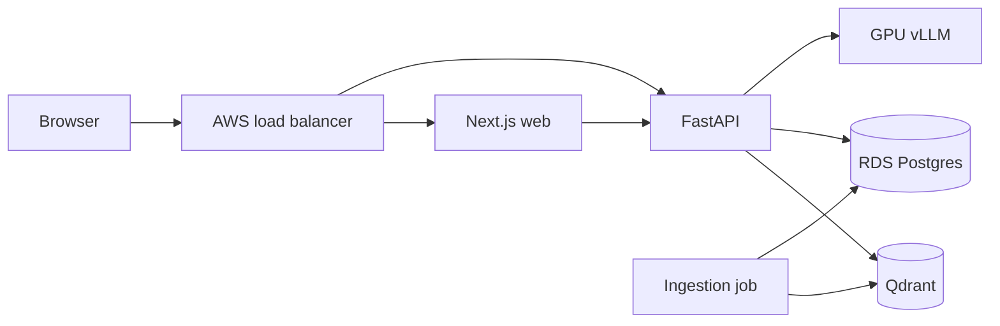
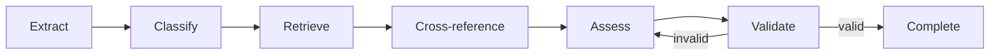

# Architecture

I keep source clauses and generated assessments inside the cluster data boundary. The web
server calls the API over a cluster service; the browser bundle does not embed that endpoint or
receive direct access to regulated sources.

## Audit reads and replay comparison

I keep audit inspection on a Postgres-only path. Listing events, reading a recorded
decision, and comparing replays do not initialize or call Qdrant or the LLM. This is
intentional: evidence about an incident must remain available while the decision system
is impaired.

I treat replay divergence as an expected audit outcome, not an API failure. A later run
may differ because its model, prompt, source corpus, or code changed. The comparison
returns the changed fields while preserving both recorded decisions. That difference is
the evidence an auditor needs to decide whether the earlier outcome remains defensible.

## Screening graph

The six-node LangGraph path is linear until citation validation. A failed validation returns to
assessment instead of emitting an unsupported result.

## Change impact analysis

When ingestion detects that a document version supersedes an earlier one, `impact.py` computes
two things: which clauses changed text, and which past screening decisions cited a now-superseded
clause. Neither computation calls the LLM. The clause diff matches on `clause_path`, not
`clause_id` - the id embeds the version string, so it is never stable across a version bump. A
source that renumbers a section between versions will show as a removed clause plus an added one
rather than a modification. I accept that as a known limitation rather than building similarity
matching to paper over it.

Affected decisions come from a JSONB query over the existing `audit_events` table: every
`screen.completed` payload whose citations start with the superseded `doc_id:version:` prefix.
There is no separate impact table. The result is itself written back as a
`document.impact.completed` audit event, so a change's downstream effect is discoverable the same
way every other system-generated finding is - through the audit trail, not a bespoke report. The
same computation is also available on demand at `GET /documents/{doc_id}/impact`, for a check that
does not want to wait on the next ingestion run.

## Posture reporting

`PostureReportRepository` computes every figure - activity counts, risk distribution, period
movement - with SQL against `audit_events`. The LLM never sees a count and is never asked to
produce one. `_qualitative_facts` strips every digit from what reaches the narrator: it gets
"screening activity increased" and "unresolved questions present," never a number to restate or
get wrong. This is the same guardrail philosophy as citation validation
([ADR-003](adr/003-guardrails.md)) applied to reporting instead of Q&A - keep the deterministic
result and the probabilistic commentary on separate paths, and let the probabilistic one fail
without taking the deterministic one down with it. When narration fails, `_with_commentary` logs
the failure and returns the report with its figures intact and `commentary` left `None`; nothing
about a posture report depends on the LLM being reachable.

## Regulated-data boundary

Every route except `/healthz` and `/readyz` requires an `X-API-Key` header, checked with a
constant-time comparison. There is no default key - an unconfigured deployment rejects every
protected request rather than serving them unauthenticated.

The [API egress NetworkPolicy](../deploy/helm/templates/api-networkpolicy.yaml) implements the
rule that regulated text cannot leave for an external model provider. It denies every API egress
destination except Qdrant on 6333, Postgres on 5432, vLLM on 8000, and cluster DNS on 53. DNS is
an infrastructure exception; it cannot receive application payloads.

I chose a CIDR allow-list for RDS because Kubernetes NetworkPolicy cannot select an external
service by DNS name. The default is an example `/32`; deployment values must replace it with the
RDS network-interface address. Failover can change that address, so the chart values and policy
need an update during the same operation. I prefer this operational cost to allowing port 5432
across the whole VPC.

Qdrant runs as one StatefulSet replica on a gp3 persistent volume. That is sufficient for the
demo, but it is not a highly available vector-store design. vLLM is isolated on the labelled GPU
node group with the matching taint tolerance.

The production API image digest must contain the pinned embedding and reranker weights. The
egress policy deliberately prevents downloading them when a pod starts. The ingestion Job uses
the same image, which includes the corpus manifest but fetches the verified source files when the
hook runs.
