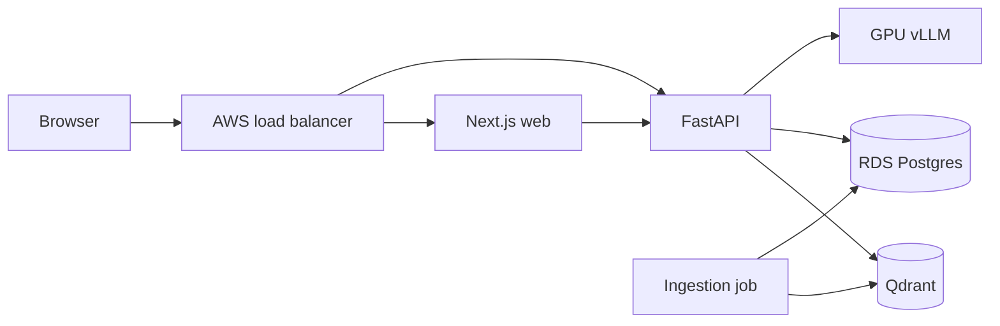
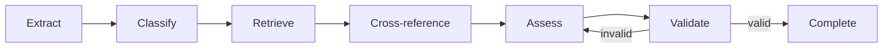

# Architecture

I keep source clauses and generated assessments inside the cluster data boundary. The web
server calls the API over a cluster service; the browser bundle does not embed that endpoint or
receive direct access to regulated sources.

## Audit reads and replay comparison

I keep audit inspection on a Postgres-only path. Listing events, reading a recorded
decision, and comparing replays do not initialize or call Qdrant or the LLM. This is
intentional: evidence about an incident must remain available while the decision system
is impaired.

I treat replay divergence as an expected audit outcome, not an API failure. A later run
may differ because its model, prompt, source corpus, or code changed. The comparison
returns the changed fields while preserving both recorded decisions. That difference is
the evidence an auditor needs to decide whether the earlier outcome remains defensible.

## Screening graph

The six-node LangGraph path is linear until citation validation. A failed validation returns to
assessment instead of emitting an unsupported result.

## Regulated-data boundary

The [API egress NetworkPolicy](../deploy/helm/templates/api-networkpolicy.yaml) implements the
rule that regulated text cannot leave for an external model provider. It denies every API egress
destination except Qdrant on 6333, Postgres on 5432, vLLM on 8000, and cluster DNS on 53. DNS is
an infrastructure exception; it cannot receive application payloads.

I chose a CIDR allow-list for RDS because Kubernetes NetworkPolicy cannot select an external
service by DNS name. The default is an example `/32`; deployment values must replace it with the
RDS network-interface address. Failover can change that address, so the chart values and policy
need an update during the same operation. I prefer this operational cost to allowing port 5432
across the whole VPC.

Qdrant runs as one StatefulSet replica on a gp3 persistent volume. That is sufficient for the
demo, but it is not a highly available vector-store design. vLLM is isolated on the labelled GPU
node group with the matching taint tolerance.

The production API image digest must contain the pinned embedding and reranker weights. The
egress policy deliberately prevents downloading them when a pod starts. The ingestion Job uses
the same image, which includes the corpus manifest but fetches the verified source files when the
hook runs.
